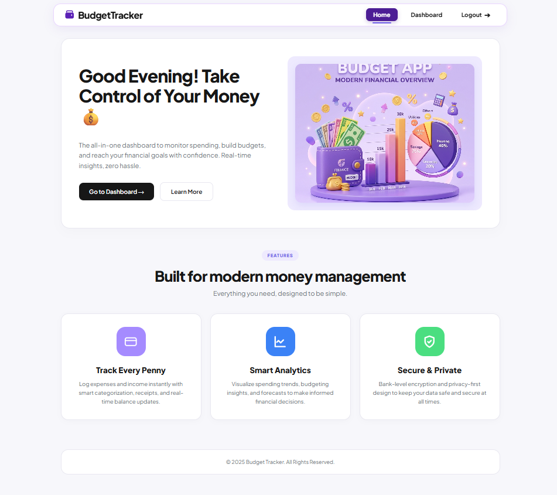

# 💰 Personal Budget Tracker

A full-stack **MERN application** designed to help users manage their personal finances easily. The application allows users to securely register and log in, track income and expenses, manage transactions, monitor their balance, and set monthly budget limits through a simple and responsive dashboard.

## 🌐 Live Demo

🔗 **Frontend:**  
https://personal-budget-tracker-beju.vercel.app/

🔗 **Backend:**  
https://personal-budget-tracker-1-2iea.onrender.com
---

## ✨ Features

### 🔐 Authentication

- Secure user registration and login
- JWT-based authentication
- Protected user-specific data

### 💰 Transaction Management

- Add income transactions
- Add expense transactions
- Edit existing transactions
- Delete transactions
- Store transaction date and description
- Categorize transactions

### 📊 Dashboard

- View current balance
- View total income
- View total expenses
- Monitor financial activity

### 🔎 Search & Filtering

- Search transactions
- Filter transactions by category
- Easily find specific financial records

### 📅 Budget Management

- Set a monthly budget limit
- View remaining budget
- Track budget usage
- Visual budget progress bar

### 📱 Responsive Interface

- Clean and user-friendly interface
- Responsive design
- Simple navigation
- Easy-to-use financial dashboard

---

## 🛠️ Tech Stack

### Frontend

- React.js
- Bootstrap

### Backend

- Node.js
- Express.js
- JWT

### Database

- MongoDB Atlas
- Mongoose

### Deployment

- Vercel – Frontend
- Render – Backend
- MongoDB Atlas – Database

---
## 📸 Application Preview

### 🏠 Home Page

